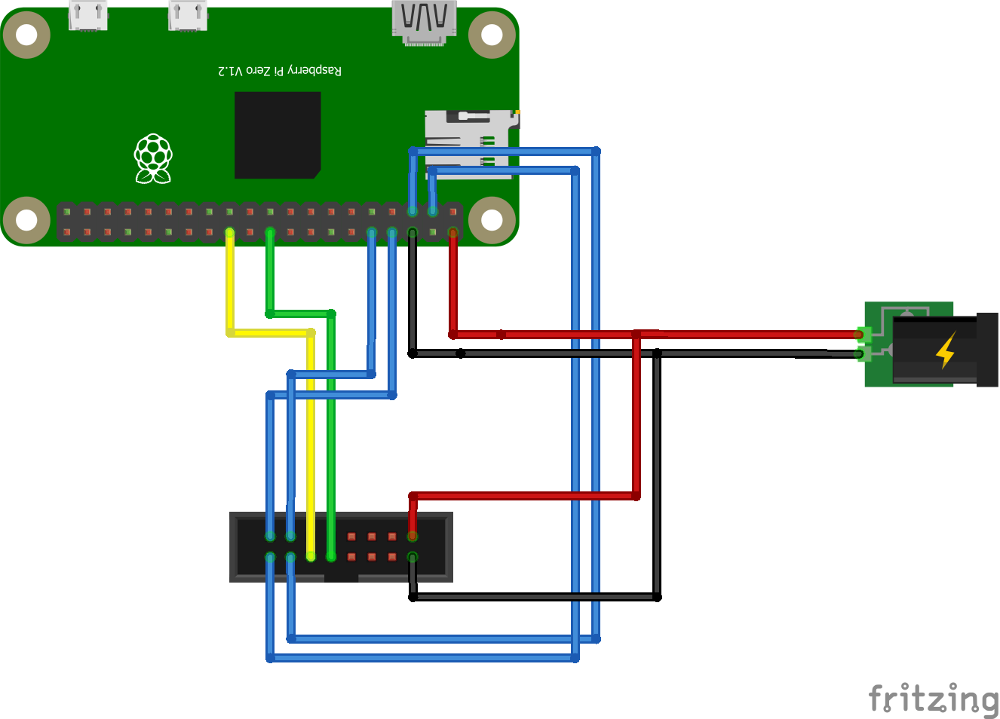

RaspberryPi Wall mounted display
================================
[](https://travis-ci.org/torkildr/raspberry-display)

## Overview
This project allows you to control the Sure P4 32x8 displays. Though, it is written for this specific version, it should pretty much work for all Holtek HT1632 based matrix displays.
 
The main goal is to give a generic, pluggable way to interface different kinds of applications with the display, without having to bother with the driver stuff.

This package also comes with an HTTP-API, making it possible to easilly interface with 3rd party stuff (e.g I'm using it for a [Home Assistant integration](https://github.com/torkildr/appdaemon-conf/blob/master/apps/display.py))

## Application Design

Tha main application consists of two two basic parts:

`curses-client`, an interactive client, probably best used to test the hardware setup and display capabilites.

`fifo-client`, this client will listen for API queued commands on named pipe. This queue is what you will interface with from
your own application.

Both of these applications also come in a `mock-` version. These will work without the physical hardware, and is perfect
for test setups or debugging the API usage.

Take a look at the [Server API](http-api), for typical usage. A good starting point to understand how stuff
works together is running `./bin/mock-fifo-client` and `python http-api/test.py`

## API

### HTTP API

The [HTTP API server](http-api/server.py) is a simple wrapper of the fifo client, and its goal is to expose all the functionality present there as HTTP endpoints.

The server is exposed on port `8080`.

Endpoint    | JSON-payload                   | Example
------------|--------------------------------|-----------
/text       | text: string, time: bool       | { "text": "foobar", "time": true }
/time       | format: string                 | { "format": "%H:%M:%S" }
/scroll     | arg: string                    | { "arg": "none" }
/brightness | value: 0-15                    | { "value": 10 }
/clear      | N/A                            |

To call the HTTP endpoint, simply POST to the endpoint, ie:

```bash
curl -i http://localhost:8080/time -d '{"format": "%A, %b %-d %H:%M:%S"}'
```

### FIFO Client

The API for the `fifo-client` is exposed through the named pipe at `/tmp/raspberry-display`.

All commands are on the format, `command:argument`, terminated by `\n`. Some commands do not take an argument, in this case, it will simply
be omitted, e.g `command:`.

Currently, only a limited set of ascii characters are supported. The API expects `iso-8859-1`, and any unknown characters will simply be rendered as a single space.

Command     | Argument  | Details
------------|-----------|---------
text        | *text to display* | Changes the text to render. It will not change other parameters, like scroll mode.
text-time   | *text to display* | Shows the current time, together with a user supplied text
time        | *optional format* | Display a dynamic time, using `strftime` formatting.
scroll      | left  | Scroll text from right to left
scroll      | right | Scroll text from left to right
scroll      | auto  | Scroll text if it exceeds the display area
scroll      | none  | Disable scrolling
scroll      | reset | Restart scrolling, typically useful when changing text
brightness  | 0-15  | Set display brightness 
quit        | *n/a*  | Quit client and turn off display 

## Building
First install the system pre-requisites and the WiringPi library.

You might want to change the [display headers](src/ht1632.h) if you have a setup that is different than the reference setup.

If you're on a debian system, like raspbian, this is simply
```bash
./install-prereqs-debian.sh
./install-wiringPi.sh
```

Once this is done, you should be able to build the project with
```bash
make
```

## Installation

Installing the application will place the binary in a system wide location, and create systemd service files to make sure the process
is always running.

**NB:** The service will be installed as the current running user. For this to work, the user needs access to the SPI-device.

After you have built the application, you can install it with
```bash
sudo make install
```

This will install the `fifo-client` to `/usr/bin/fifo-client`, the `http-api` to `/usr/local/bin/display-http-api` and create systemd service files.

To (re)start the services, run
```bash
sudo systemctl restart raspberry-display-driver
sudo systemctl restart raspberry-display-server
```

To view log files, you can use the systemd journal
```bash
sudo journalctl -f -u raspberry-display-driver
sudo journalctl -f -u raspberry-display-server
```

To uninstall
```bash
sudo make uninstall
```

## Hardware

The application is designed to use `spi0` on the rasperry pi, and four generic GPIO pins. This can be changed, but for a basic
setup, just follow the reference connection.

All pins referenced are [physical pins](https://pinout.xyz/pinout#). The application uses WiringPi-numbering for CS-pins. These
will be different from the physical pins (use [this guide](https://pinout.xyz/pinout/wiringpi) for WiringPi numbering).

Pin | Usage
--- | -----
2   | 5V
6   | Ground
3   | CS1
5   | CS2
8   | CS3
10  | CS4
19  | MOSI/Data
23  | SCLK/WR

### Reference hardware


## Acknowledgements
This project is written by Torkild Retvedt, as a rewrite of a similar project for the [Arduino UNO](https://github.com/torkildr/display)

Much of the ht1632 driver is inspired by [this repo](https://github.com/DerBer/ht1632clib).

## License
This software is licensed under the MIT license, unless specified.

